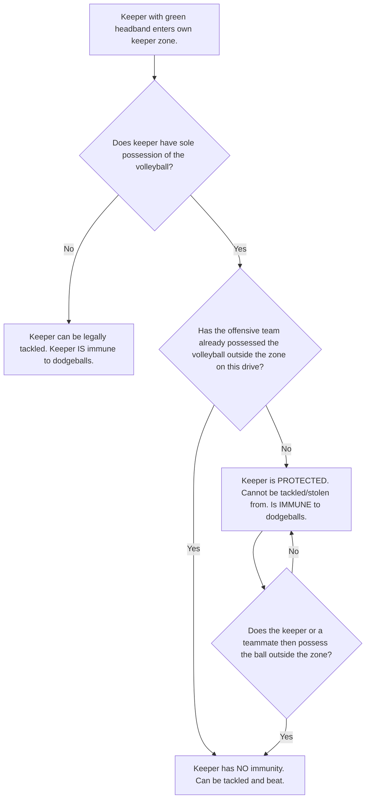

# Referee Manual

**Edition: IQA Rulebook 2024**


## **An Official's Guide to Rule Application, Game Management, and On-Pitch Excellence**

---

### **Page 1: Introduction**

#### **Welcome to Officiating**

This manual is the definitive guide for quadball referees, from trainees to seasoned Head Referees. It translates the International Quadball Association (IQA) Rulebook into practical, on-pitch application. Our goal is to foster consistency, safety, and fairness in every game we officiate.

As referees, we are the guardians of the game's integrity. Our responsibilities extend beyond simply calling fouls; we are game managers, safety officers, and facilitators of fair play. This manual is designed to equip you with the knowledge, procedures, and confidence needed to excel in this role.

#### **Core Principles of Officiating**

Every decision a referee makes should be guided by these core principles:

1.  **Safety First:** The physical well-being of all participants—players, officials, and staff—is our paramount concern. Proactive officiating that prevents dangerous situations is the hallmark of a great referee.
2.  **Fairness and Impartiality:** We must apply the rules consistently to both teams, without bias or prejudice. Every call should be based on the rules and your observation, not on reputation, score, or external pressure.
3.  **Game Control and Flow:** An effective referee manages the game's tempo, controls player conduct, and minimizes unnecessary stoppages. The goal is to facilitate a competitive, fluid, and safe contest.
4.  **Knowledge and Application:** A comprehensive understanding of the rules is non-negotiable. This includes not just the "what" but the "why" behind each rule, enabling correct application in complex and edge-case scenarios.
5.  **Professionalism and Communication:** Clear, concise, and respectful communication with players, captains, and fellow officials is essential. Our conduct, on and off the pitch, must be professional and command respect.

#### **How to Use This Manual**

This document is structured to build your officiating knowledge from the ground up.

- **Part 1: Pre-Game Preparations:** Covers everything you must do before the first "Sticks Up."
- **Part 2: Core Game Mechanics:** Details the fundamental procedures that form the backbone of game flow.
- **Part 3: Position-Specific Officiating:** Dives into the unique rules and interactions for each player position.
- **Part 4: Contact & Fouls:** Provides a deep dive into the most complex and critical aspect of officiating—physicality.
- **Part 5: Penalties & Advanced Procedures:** Explains the penalty system and advanced game management tools like advantage.
- **Part 6: Post-Game & Appendix:** Outlines your final duties and provides quick-reference materials.

Each section references the specific IQA rule (e.g., `Rule 2.5.1`) for easy cross-referencing. Study this manual, know the rules, and take the pitch with confidence.

---

### **Page 2: Game Setup & Field Inspection**

#### **The Referee’s First Responsibility: A Safe & Compliant Field**

Before players take the field, the officiating crew must ensure the entire playing area is safe and correctly marked. A thorough inspection prevents injuries and ensures the game is played under fair and standardized conditions.

**Pre-Game Field Inspection Checklist (Head Referee's Duty)**

Use this checklist at least 30 minutes prior to the scheduled game time.

| Item                      | Rule Ref. | Standard                                                                                                                                                                     | Check |
| ------------------------- | --------- | ---------------------------------------------------------------------------------------------------------------------------------------------------------------------------- | ----- |
| **Pitch Boundaries**      | `2.1.1`   | 33m x 60m rectangle. Clearly marked with cones or lines. No ambiguity.                                                                                                       | \[ ]  |
| **Keeper Zone Lines**     | `2.1.3`   | Marked at 16.5m from the endlines (which is **13.5m from the midfield line**).                                                                                                | \[ ]  |
| **Midfield Line**         | `2.1.2`   | Clearly bisects the pitch.                                                                                                                                                   | \[ ]  |
| **Player Area**           | `2.1.12`  | Player area (44m x 66m) must be clear of all non-essential obstacles (bags, water bottles, spectators). Scorekeeper's table must be outside this area.                          | \[ ]  |
| **Hoop Positioning**      | `2.2.3`   | Hoops are on the endline (**30m from midfield**). Tall hoop is central. Short hoop is on the left, medium on the right (when facing from midfield). Spacing is 2.75m apart.       | \[ ]  |
| **Hoop Stability & Safety** | `2.2.1`   | Hoops are freestanding and stable. No dangerous materials (metal/concrete posts/bases). No sharp edges. Hoops are at correct heights (Short: ~91cm, Mid: ~137cm, Tall: ~183cm). | \[ ]  |
| **Ball Positions**        | `2.1.11`  | Volleyball is at the center of the midfield line. One Dodgeball is at the intersection of midfield and the volleyball runner start line. One Dodgeball is at each keeper zone line midpoint. | \[ ]  |
| **Ground Conditions**     | N/A       | Field is checked for hazards: holes, sprinkler heads, sharp debris, excessively muddy or slippery conditions that pose a danger to players.                                    | \[ ]  |
| **Substitution Areas**    | `2.1.7`   | Clearly marked areas for each team.                                                                                                                                          | \[ ]  |

#### **Officiating Decision Point: Unsafe Field Conditions**

**Scenario:** During inspection, you discover a broken sprinkler head in a keeper's zone.

**Procedure:**

1.  **Do Not Start the Game.** Safety is paramount.
2.  **Inform Event Staff Immediately.** The primary responsibility for fixing venue issues lies with them.
3.  **Consult Both Captains:** Explain the issue and the potential delay. Keep them informed.
4.  **Assess Fixability:**
    - **If fixable (e.g., can be covered safely):** Work with event staff to implement a solution. Re-inspect thoroughly before proceeding.
    - **If not fixable:** The Head Referee, in consultation with the event director, must decide to either:
        *   **Suspend the Game:** If the issue can be resolved later (Rule `3.7.1`).
        *   **Move the Pitch:** If another field is available.
        *   **Cancel/Forfeit:** In extreme cases where no safe alternative exists.

**Referee Tip:** Never compromise on safety. A delay is always preferable to an injury. Document any field issues on your game report.

---

### **Page 3: Equipment Inspection & Pre-Game Meeting**

#### **Ensuring Fair Play & Safety: Player Equipment**

Thorough equipment checks prevent illegal advantages and protect players from injury. The Head Referee can delegate checks to ARs but is ultimately responsible.

**Equipment Inspection Protocol (All Officials)**

| Equipment             | Rule Ref.        | Key Checkpoints                                                                                                                                                      | Common Violations                                                                                                         |
| --------------------- | ---------------- | -------------------------------------------------------------------------------------------------------------------------------------------------------------------- | ------------------------------------------------------------------------------------------------------------------------- |
| **Sticks**            | `2.4.1`          | Correct length (98-102cm). Plastic pole only. Ends capped if hollow. No splinters. Only one 20cm grip tape section. Must not be attached to body.                    | Reinforced sticks, sharp ends, illegal attachments.                                                                       |
| **Headbands**         | `2.5.3`          | Correct color for position. Worn on the forehead. Clearly visible. Not worn over a hat with conflicting colors.                                                      | Player wearing wrong color; headband on arm/neck; hidden by hair.                                                         |
| **Jerseys & Numbers** | `2.5.2`, `2.5.4` | Uniform color. Unique number (0-99). No yellow/gold or black/white vertical stripes. Number clearly visible on back.                                                | Duplicate numbers (`BlueCard` to captain, `Rule 2.5.4.B`), illegal colors.                                                |
| **Mouthguards**       | `2.5.2.E`        | Must be worn. Must cover biting surfaces and protect teeth/gums. **"No mouthguard, no play."**                                                                          | Player holding it in hand or sock. Cut-down or "pacifier" style guards are illegal.                                       |
| **Forbidden Equipment** | `2.5.10`         | **NO JEWELRY.** Check for rings, necklaces, earrings. (Exception: flush plastic retainers). No hard casts, no recording devices, no grip substances.                    | Taped-over rings (`RedCard`), wearing a smartwatch (`Ejection`).                                                            |
| **Padding/Braces**    | `2.5.5`          | Must pass the "knock test" (no hard knock sound). Must be ≤ 2.5cm thick. Hard elements on braces must be fully covered and pass the knock test. Shin guards under socks. | Exposed metal/hard plastic on a brace. Padding that is too hard.                                                          |
| **Game Balls**        | `2.3`            | Volleyball and Dodgeballs must be properly inflated (not rock-hard, not flat). Flag must be a ball in a sock (25-30cm tail).                                           | Over-inflated dodgeballs (dangerous), deflated volleyball (affects play).                                                 |

**Enforcing Equipment Rules:**

- **Pre-Game:** Player must fix the issue before being allowed to play.
- **Entering Play Illegally:** `BlueCard` for entering play without mandatory (`2.5.2`) or with illegal (`2.5.5`+) equipment.
- **Discovered During Play:** Use Accidental Equipment Infringement procedure (`2.5.7`). Do not stop play unless dangerous. Player must leave the pitch immediately to correct the issue.

#### **The Pre-Game Meeting: Setting the Tone**

The pre-game meeting (`Rule 3.1.1`) is the Head Referee’s opportunity to establish authority and ensure clear communication.

**Meeting Agenda:**

1.  **Introductions:** Introduce yourself and your officiating crew. Identify the Speaking Captain for each team. Remind them they are the *only* player who can discuss calls during stoppages.
2.  **Coin Toss (`3.1.2`):**
    - Identify the visiting/designated "calling" team.
    - Winner of the toss chooses one: Defend a side, choose volleyball runner start position, or choose dodgeball runner start position. Loser chooses from the remaining options.
3.  **Point of Emphasis:** Briefly mention 1-2 key points for the game (e.g., "We will be watching contact around helpless receivers closely," or "Captains, ensure your substitutes are legal.").
4.  **Confirm Gender & Flag Runner:**
    - Ask if there are any players the officials should be aware of regarding the gender maximum rule (`1.2.3`).
    - Identify the official Flag Runner for the game.
5.  **Ground Rules & Questions:** Address any field-specific ground rules (e.g., "The player area ends at the treeline."). Ask captains if they have any questions.

**Referee Tip:** Keep the meeting brief, professional, and to the point. Project confidence. This is your first and best chance to set the expectation for a well-officiated game.

---

### **Page 4: Game Start & Stoppages**

#### **Starting the Game: The Sticks Up Procedure**

A clean game start is critical. The "Sticks Up" procedure (`Rule 3.2.2`) must be executed with precision and authority by the Head Referee. ARs and the Flag Referee play a key role in spotting false starts.

**Referee Positioning for "Sticks Up":**

- **Head Referee:** At the midfield line on the scorekeeper's sideline, with a clear view of the volleyball and both sets of runners.
- **Assistant Referees:** Positioned on the starting sideline, each monitoring a section of players for false starts.
- **Flag Referee:** Positioned on the starting sideline near midfield, providing another set of eyes on the central runners.

**The Cadence:**

1.  **Confirm Readiness:** Verbally and visually confirm with all officials and both teams. Ensure balls are perfectly placed on their marks.
2.  **"Sticks Down!"**: Loud and clear. All players must place their sticks flat on the ground.
    - **Officiating Focus:** Watch for players lifting their sticks or having them angled off the ground. This is a common precursor to a false start. Correct immediately.
3.  **"Ready!"**: A few seconds after "Sticks Down." This is the players' cue to get into their starting stance.
    - **Officiating Focus:** Sticks must remain flat on the ground. No part of the body (except the stick) may cross the starting line.
4.  **"Sticks Up!"**: A few seconds after "Ready." Play begins on the **first "S" sound**.
    - **Officiating Focus:** Watch for any player moving or lifting their stick *before* the "S" sound. This is a **False Start (`BlueCard`, `Rule 3.2.2.E`)**.

**Decision Tree: Adjudicating a False Start**

```mermaid
graph TD
    A[HR calls "Ready"] --> B{"Is there movement before 'Sticks Up'?"};
    B -- No --> C[Game Starts Legally];
    B -- Yes --> D{"Did an official see it?"};
    D -- No --> E[Play continues. "Missed call."];
    D -- Yes --> F[Official throws flag/yells. HR blows whistle to stop play.];
    F --> G[Identify the fouling player(s).];
    G --> H[Issue a BlueCard for False Start (`3.2.2.E`)];
    H --> I[Send player to penalty box. Team plays down one.];
    I --> J[Reset all players and balls and restart the entire Sticks Up procedure.];
```

#### **Managing Stoppages: Maintaining Control**

When the whistle blows, the game world must freeze instantly. A referee's control over stoppages (`Rule 3.3.1`) dictates the pace and discipline of the game.

**The Stoppage Protocol:**

1.  **Whistle:** Loud, sharp, paired short blasts (`peep-peep!`).
2.  **Verbal Command:** "STOP!" or "FREEZE!"
3.  **Mechanic:** Raise one hand straight up, palm open.
4.  **Timekeeper Action:** Game clock and all penalty clocks stop.
5.  **Player Action:** All players must immediately stop, drop their sticks at their feet, and hold their position.

**Referee Responsibilities During a Stoppage:**

- **Enforce the Freeze:** Be vigilant for players who move after the whistle. Intentionally and illegally moving during a stoppage is a **Yellow Card (`Rule 3.3.1.C`)**. This includes taking a few extra steps, moving towards a ball, or moving to a more advantageous position.
- **Ball Control:** Players maintain possession of balls they held. They must not touch any other ball. Intentionally moving or taking hold of a ball during a stoppage is a **Yellow Card (`Rule 3.3.1.C`)**.
- **Adjudication:** Confer with other officials if needed, identify the foul, signal the penalty, and communicate clearly to the captains and scorekeeper.
- **Restart Preparation (`3.3.3`):**
    - Call "Remount!"
    - Ensure all players are back on their sticks at the correct location.
    - Blow a single short whistle blast to restart play. The timekeeper simultaneously restarts all clocks.

**Referee Tip:** Be a stickler for stoppage discipline early in the game. If you let players move around on the first few stoppages, you will lose control for the rest of the match.

---

### **Page 5: Timing Procedures & Game Management**

#### **The Clock is King: Managing Game Time**

Accurate timekeeping is a cornerstone of a fairly administered game. The Head Referee must work in close coordination with the Timekeeper.

**Key Timing Events & Referee Actions:**

| Event                 | Game Time  | Rule Ref.  | Referee/Timekeeper Responsibilities                                                                                                                                     |
| --------------------- | ---------- | ---------- | ----------------------------------------------------------------------------------------------------------------------------------------------------------------------- |
| **Timeout Request**   | 0:00-19:00 | `3.3.4.A`  | Speaking Captain can request during a "lull in play." HR must quickly scan for *any* active play (beater duels count!) before granting. If granted, stop play.          |
| **Timeout Request**   | Any Time   | `3.3.4.A`  | Speaking Captain can request during any existing stoppage.                                                                                                              |
| **Illegal Timeout**   | N/A        | `3.3.4.A.v`| Requesting a timeout when not allowed (e.g., during active play after 19:00, or second timeout for a team) is a **Blue Card**.                                          |
| **Seeker Report**     | ~19:00     | `3.4.2.C`  | Timekeeper should announce "19 minutes." Both teams' seekers should report to the scorekeeper's table. They are substitutes and must not enter the pitch.                   |
| **Flag Runner Enters**| 19:00      | `3.4.2.D`  | Flag Runner enters the player area and prepares.                                                                                                                        |
| **Seeker Release**    | 20:00:00   | `3.4.2.E`  | At the exact end of the seeker floor, Timekeeper releases seekers from their respective penalty box areas onto the pitch.                                                 |
| **Seeker False Start**| Pre-20:00  | `3.4.2.C`  | A seeker entering the pitch before being released by the timekeeper is a **Blue Card**. Penalty time starts at 20:00.                                                    |
| **Heat Stoppage**     | 15:00, 25:00, etc. | `3.3.5`    | If heat procedures are in effect, HR stops play at the end of the current drive once the trigger time is reached. The first stoppage is 4 mins, subsequent are 2 mins. |

#### **Managing the Flow: Substitutions**

Substitutions (`Rule 1.3`) happen "on the fly" and require sharp eyes from the referees on the scorekeeper's sideline.

**Legal Substitution Procedure (`1.3.1`):**

1.  **Exiting Player:** Must be on stick.
2.  **Exit Point:** Must exit the pitch through their team's designated substitution area.
3.  **Dismount:** Must be *fully off the pitch* before dismounting.
4.  **Exchange:** Equipment (e.g., headband) is traded off the pitch.
5.  **Entering Player:** Mounts stick *in the substitution area*, then steps onto the pitch.

**Referee Focus & Common Violations:**

- **Location:** The entire action must happen within the substitution area.
- **Timing:** The entering player cannot step onto the pitch until the exiting player is fully off. This is the most common violation.
- **Too Many Players:** A team having more than its legal number of players on the pitch due to a botched substitution.
- **Off-Stick Sub:** A player who is off-stick (e.g., just beat) cannot substitute out. They must complete the back-to-hoops procedure first.

**Enforcement:**

- **Substitution Violation (`1.3.1.F`):** If the entering player has not yet interacted with play, this is a procedural foul. Use the **Repeat Procedure** penalty. The player must exit and re-enter legally.
- **Illegal Substitution (`1.3.1.F.i`):** If the entering player illegally enters *and* interacts with play, this is a **Blue Card**.
- **Too Many Players (`1.2.2`):** If a count reveals too many players (e.g., 5 chasers), this is an **Illegal Set of Players** (Yellow Card to Captain).

**Referee Tip:** The AR nearest to the benches should be primarily responsible for substitution monitoring. Use preventative officiating: a clear verbal warning ("Wait for your player to exit, Green!") can prevent a penalty.

---

### **Page 6: Scoring Validation & Disputes**

#### **Confirming the Goal: More Than Just In or Out**

A goal is worth 10 points and fundamentally changes the game state. The Head Referee is the final arbiter of every goal. Assistant Referees and Goal Judges must provide immediate, clear information to aid this decision.

**Conditions for a Good Goal (`Rule 4.1.1`):**

A goal is ONLY good if ALL of the following are true at the moment the ball passes *entirely* through the hoop:

1.  **Complete Passage:** The *entire* volleyball must pass through the hoop. It can be from front-to-back or back-to-front.
2.  **Live Volleyball:** The volleyball must be live (i.e., not "dead" after a previous goal).
3.  **Scorable Volleyball:** The ball must not be "unscorable" (e.g., thrown as part of natural motion after being knocked off stick, `Rule 5.6.3`).
4.  **No Preceding Scoring Team Foul:** The scoring team cannot have a pending card or volleyball turnover foul that occurred before the goal.
5.  **Clean Shooter:** The scoring player must not have committed a foul (back-to-hoops or card) immediately before receiving the ball or while possessing it for the shot.
6.  **Playable Hoop:** The hoop was not dislodged (broken, fallen, unplayable) when scored upon (`Rule 4.3.1`).

**Referee Mechanics for Scoring Plays:**

- **Goal Judge/AR:** As a shot is made, get a position in line with the goal line.
    - If good, raise one arm straight up.
    - If no good (e.g., hit the post, didn't go all the way through), use the "no goal" signal (crossing arms in front of the chest).
- **Head Referee:**
    - Observe the entire play, looking for shooter fouls, contact, and off-stick status.
    - Receive input from your crew.
    - **To Confirm:** Blow one long whistle blast and raise both arms high. Verbally announce the score.
    - **To Invalidate:** Wave the goal off with a clear horizontal motion. Announce "No goal," and state the reason (e.g., "No goal, shooter was off-stick!").

#### **Special Scoring Situations**

**Goaltending (`Rule 4.1.2`):**

- **Definition:** A non-keeper chaser reaches *through their own hoop from the back* to block a shot, or touches a ball that is already partway through a hoop.
- **Ruling:** The goal is awarded as if it were good. Play stops and restarts as a normal goal.
- **Referee Cue:** Watch for defenders' hands near their own hoops when a shot is imminent.

**Broken or Fallen Hoops (`Rule 4.3`):**

- **Dislodged Hoop:** A hoop is unplayable if it is broken, has fallen over, or the hoop-loop has touched the ground. A *turned* hoop is still playable.
- **Scoring:** A goal does not count on a dislodged hoop. A goal *does* count if the ball passes completely through *while* the hoop is falling, but *before* it becomes dislodged.
- **Procedure (`4.3.2`):**
    - Generally, do not stop play. Announce verbally, "Middle hoop is down!"
    - Fix the hoop when play moves away from the area.
    - Stop play immediately if all three hoops are down or if a broken hoop poses a safety hazard.
- **Penalties (`4.3.3`):**
    - **Blue Card:** Recklessly or repeatedly dislodging hoops.
    - **Red Card:** *Intentionally* dislodging a hoop to prevent a score. This is a serious act of foul play.

**Referee Tip:** Communication is key. When a goal is scored, every official in the vicinity needs to form an opinion and signal. For a chaotic play with multiple potential infractions, a quick conference between officials is better than a hasty, incorrect call.

---

### **Page 7: Off-Stick Play & Resets**

#### **The Core Mechanic: Being "Off Stick"**

Being "knocked off stick" is a fundamental concept in quadball. It removes a player from active play until they complete a specific reset procedure. As a referee, you must be vigilant in identifying and enforcing this.

**How a Player Becomes Off Stick (`Rule 5.2.1`):**

1.  **Beat by a Live Dodgeball:** Struck by a live dodgeball thrown by an opponent. This is the most common way.
2.  **Dismounting:** The player loses contact with their stick, their stick is no longer between their legs, or they drop it (`Rule 5.1.2`). This often happens during physical contact or when a player stumbles.

**The Back-to-Hoops Procedure (`Rule 5.3.1`):**

When a player is knocked off stick, they must **immediately** follow these steps in order:

1.  **Drop Ball & Dismount:** Instantly drop any ball they are holding and dismount their stick.
    - **Referee Focus:** The ball must be dropped, not thrown, passed, or rolled. A dodgeball dropped this way is dead. A volleyball dropped this way is unscorable until reset.
2.  **Touch Hoops:** Return to their own end of the pitch and physically touch one of their own team's upright hoops (pole or loop, not the base) with their body (not their stick).
3.  **Remount:** Remount their stick *after* touching the hoop.
4.  **Return to Play:** The player is now fully legal and can re-engage.

**Officiating Off-Stick Play:**

- **Clear Communication:** Yell "BEAT!" or "OFF STICK!" to inform the player. If they were hit by a dead ball, yell "SAFE!" or "CLEAR!".
- **Enforcement:**
    - **Illegally Interacting (`5.3.2`):** If an off-stick player makes a play (e.g., tackles someone, throws a ball), it's a **Blue Card**.
    - **Natural Motion (`5.6`):** A player is allowed to finish *one single natural motion* that was already started when they were knocked off stick (e.g., finishing a throw). A dodgeball thrown this way is **dead**. A volleyball thrown this way is **unscorable**. Any new action after becoming off-stick is illegal.
    - **Natural Motion Violation (`5.6.2`):** Intentionally making a play after being knocked off stick under the guise of "natural motion" is a **Yellow Card**.
    - **Willfully Ignoring (`5.2.1.B`):** A player who is clearly beat and makes no attempt to dismount is a **Yellow Card**.
    - **Unnoticed Knock Off (`5.3.4`):** If a player seems genuinely unaware, stop play and inform them. If they affected play, it's a **Blue Card**.

#### **Volleyball Progress: The Reset Rule**

To encourage offensive play, teams are limited in their ability to move the volleyball backward. This is managed by the "reset" rule (`Rule 7.4.3`).

- **Restrictor Lines:** The midfield line and the offensive team's own keeper zone line.
- **What is a Reset?** An offensive player carries or propels the volleyball backward across one of their restrictor lines.
- **Legal Reset:** Each team gets **ONE** legal reset per offensive drive.
    - **Mechanic:** After the first legal reset, the HR shouts **"RESET USED!"** and swings an arm, palm down, toward the offensive team's hoops.
- **Illegal Resets:**

        1.  **Second Reset:** Using a second reset on the same drive.
        2.  **Illegal Propulsion:** Propelling the ball backward across a line without it being a legitimate pass attempt to a teammate. Simply throwing it backward into space is illegal.

**Ruling:** An illegal reset is a **Volleyball Turnover**. Stop play and award the ball to the other team.

---

### **Page 8: Chaser & Keeper Officiating**

#### **The Keeper Zone: A Sanctuary with Limits**

The Keeper Zone (`Rule 7.2`) grants the keeper special protections, but these protections are conditional. Referees must track the state of the keeper's immunity throughout the game.

**Protected Keeper Powers (`Rule 7.2.2.A`):**

A keeper is "protected" only when **all** of the following are true:

1.  They are wearing the green headband.
2.  They are at least partially inside their own keeper zone.
3.  Their team has **not** yet possessed the volleyball outside the keeper zone on the current drive.

A protected keeper has two key immunities:

1.  **Possession Immunity:** Opposing chasers cannot tackle or steal the volleyball from them once the keeper has *sole possession*.
2.  **Dodgeball Immunity:** They cannot be knocked off stick by a beater's dodgeball.

> **Referee Tip:** Remember that a Keeper's dodgeball immunity is active whenever they are in their zone, a concept that applies on both offense and defense. If a chaser is driving to score, the defending keeper in their zone is still immune to being beat.

**Losing Protection (`Rule 7.2.2.B`):**

The keeper loses **all** special powers for the remainder of that offensive drive the *instant* a teammate possesses the volleyball outside the keeper zone, or the keeper themselves carries or passes it out.

**Referee Decision Tree: Keeper Immunity**


**Common Keeper-Related Fouls:**
- **Illegal Contact on Protected Keeper (`6.1.1.L`):** Tackling or stripping a protected keeper with the ball. **Standard Contact Penalty (Yellow Card)**.
- **Keeper Delay (`7.4.1.C`):** After a goal, the keeper wastes time before making the ball live, or they substitute out before making it live. **Blue Card + Volleyball Turnover**.
- **Pace of Play (`7.4.1.D`):** The offensive team must advance the ball out of their half at a walking pace. Keepers holding the ball indefinitely in the keeper zone is Delay of Game. **Blue Card + Volleyball Turnover**.

#### **Restarting After a Goal: The Keeper's Role**

After a goal is confirmed, the volleyball is "dead" (`Rule 4.2.1`). The formerly defending team's keeper is central to the restart.

**Restart Procedure (`Rule 4.2.2`):**

1.  **Goal Confirmed:** HR blows the long whistle. Volleyball is dead.
2.  **Ball Retrieval:** Any player on the scoring team may give the ball to the opposing keeper. Players on the formerly defending team may carry/pass it to their keeper.
3.  **Making it Live:**
    - **Scenario A (Keeper Touches First):** If the keeper is the first player on their team to possess the dead ball, it becomes live the instant they possess it *anywhere in their half of the pitch*.
    - **Scenario B (Teammate Touches First):** If another player on their team touches the ball first, the keeper *must* then possess the ball *inside the keeper zone* to make it live.
4.  **Restart Whistle:** HR blows a short whistle blast once the ball is live to signal that play has officially resumed.

**Referee Tip:** Observe the restart sequence closely. An illegal restart (e.g., a chaser making the ball live) can lead to confusion. If an error occurs, stop play, explain the correct procedure, and restart properly.

---

### **Page 9: Beater Officiating - Beats & Dodgeball Control**

#### **The Heart of Beater Play: The Live Dodgeball**

A "beat" is only valid if the dodgeball is **LIVE**. A referee's primary job in beater interactions is to determine the state of the dodgeball.

**What Makes a Dodgeball LIVE? (`Rule 5.2.2`)**

A dodgeball becomes live the moment it is thrown, kicked, or intentionally propelled by a beater. It remains live until it:

1.  **Touches the ground.**

2.  **Goes out of bounds.**

3.  **Is caught by an opposing beater.**

4.  **Is blocked by a held ball and then caught by the blocker's teammate beater.**

**What Makes a Dodgeball DEAD?**

A dodgeball is always **dead** if it is:

- **Dropped** by a beater who is knocked off stick or is a "struck beater."
- Thrown as part of **natural motion** after being beat.
- Thrown by a beater who has been hit and is a "struck beater" (see below).
- Inbounded via a throw.

**Referee Cue:** When a beater is hit by a dodgeball, your eyes must immediately go to the ball in their hand. If they throw it *after* being hit, you must verbally call "**DEAD BALL!**" to nullify any subsequent "beat."

#### **The Struck Beater: A Moment of Opportunity**

When a beater is hit by a live dodgeball, they are not immediately "beat." They become a **Struck Beater (`Rule 5.4.3`)**. This is a temporary state with specific rules.

**Struck Beater Procedure:**

1.  **Hit:** Beater is hit by an opponent's live dodgeball.
2.  **Drop Ball:** The struck beater MUST immediately drop any dodgeball they are holding. Failure to do so is a **Struck Beater Violation (Blue Card)**. They cannot throw or pass it.
3.  **The Choice:** The struck beater can now either:
    - **A) Attempt to Catch:** Try to catch the live dodgeball that hit them before it becomes dead. If they succeed, they are SAFE.
    - **B) Dismount:** Give up on the catch and immediately follow the back-to-hoops procedure.
4.  **Failure:** If they attempt the catch and fail (the ball hits the ground), they are officially "beat" and must proceed back to their hoops.

**Referee Focus:** This sequence happens in a split second. Watch for two key illegal actions:
1.  **Throwing While Struck:** A struck beater cannot throw their own ball. This is a **Struck Beater Violation (Blue Card)**.
2.  **Swatting:** A struck beater cannot swat or bat the ball; they must attempt a clean catch. Swatting is an **Illegal Dodgeball Swat (Blue Card)**.

#### **Headbeats: A Critical Safety Call**

Intentional or reckless throws to the head are dangerous and must be penalized strictly (`Rule 5.2.6`).

- **Definition:** A headbeat is when a thrown dodgeball's *first* point of contact on an opponent is the head or neck.
- **Illegal Headbeat:** **Yellow Card**.
- **Excessive Force Headbeat:** A headbeat thrown with egregious force. **Red Card**.

**When is a Headbeat LEGAL? (Exceptions to the Rule)**

No penalty is given if:

1.  **Player Ducks Into It:** The struck player significantly alters their head's position *after* the throw has started, putting themselves in the ball's path.
2.  **Negligible Force:** The contact is a minor graze with no force.

**Referee Judgment:** This call requires significant discretion. Consider the distance, the thrower's intent, the player's movement, and the force of the impact. When in doubt, prioritize player safety.

---

### **Page 10: Beater Officiating - Immunity & Interference**

#### **The Third Dodgeball: A Strategic Stalemate**

The third dodgeball rule (`Rule 5.5.1`) is designed to break up a stalemate where one team controls dodgeball supremacy. Referees must understand the conditions that trigger this state.

**When does the "Third Dodgeball" exist?**

ALL three of the following conditions must be met:
1.  One team possesses **two** dodgeballs.
2.  The other team possesses **zero** dodgeballs.
3.  The third dodgeball is on the ground and **DEAD**.

**Third Dodgeball Interference (`Rule 5.5.1.B`):**

The team with two dodgeballs (the "possessing team") **CANNOT** interact with the third dodgeball. It is interference if a player on the possessing team:

- Touches, kicks, or picks up the third dodgeball.
- Stands over or continually obstructs the path to the third dodgeball to prevent the other team from getting it.

**Penalty for Third Dodgeball Interference:**
This is a major penalty. Play stops.
- **Back-to-Hoops** for the fouling player.
- **Turnover of all held dodgeballs:** The two dodgeballs held by the fouling team are turned over.

#### **Dodgeball Immunity: Breaking the Stalemate**

When a "third dodgeball" situation exists, the team with zero dodgeballs can claim immunity to safely retrieve it (`Rule 5.5.2`).

**Immunity Claim Procedure & Officiating:**

1.  **The Signal:** One beater on the team with zero dodgeballs raises a closed fist high above their shoulder.
2.  **Immunity Granted:** This beater is now immune to being beat. They cannot be knocked off stick by a live dodgeball.
    - **Referee Call:** Announce "IMMUNITY!" or "IMMUNE PLAYER!" to ensure the opposing team is aware.
3.  **The Obligation (`5.5.3`):** The immune beater **MUST** proceed directly and immediately to retrieve the third dodgeball.
    - **Immunity Violation (`BlueCard`):** Doing *anything* else—throwing a non-existent ball, blocking a chaser, engaging another beater—is a penalty.
4.  **Losing Immunity:** Immunity ends the instant the beater gains possession of the third dodgeball OR if the game state changes (e.g., their teammate gets a different dodgeball). The player must lower their fist.

**Decision Tree: Adjudicating Dodgeball Immunity**

```mermaid
graph TD
    A[Is there a Third Dodgeball situation?] --> B{Does a beater from the team with 0 balls raise a closed fist?};
    A -- No --> C[Claim is Invalid. **Blue Card** (`5.5.2.B`)];
    B -- No --> D[No immunity. Play continues.];
    B -- Yes --> E[Beater is IMMUNE.];
    E --> F{Does the immune beater proceed directly to the third dodgeball?};
    F -- No --> G[**Immunity Violation (Blue Card)** (`5.5.3.A`)];
    F -- Yes --> H{Do they pick up the ball?};
    H -- No --> H;
    H -- Yes --> I[Immunity ends. Player is now a normal beater.];

```

**Common Immunity Scenarios & Rulings:**

- **Scenario:** Two beaters on the same team raise their fist.
    - **Ruling:** This is an **Improper Immunity Claim (`Back-To-Hoops`)**. Only one can be immune. One must lower their fist immediately to avoid the penalty (`5.5.2.A`).
- **Scenario:** An immune beater is on their way to the ball, and an opponent throws a dodgeball at them.
    - **Ruling:** The throw is legal, but the immune beater is not beat. Announce "SAFE, PLAYER IS IMMUNE!"
- **Scenario:** An immune beater ignores the third dodgeball and instead tries to defend their chaser.
    - **Ruling:** This is a clear **Immunity Violation (Blue Card)**. Stop play, issue the card.

---

### **Page 11: Seeker & Flag Runner Officiating**

#### **The Seeker's Game: A Duel within a Game**

Officiating the seeker-flag runner (FR) interaction requires intense focus from the Flag Referee (FR) and Head Referee (HR). The key is understanding the unique, limited contact rules.

**The Seeker Floor & Release (`Rule 3.4.2`):**

- **0:00 - 19:00:** Seeker Floor. No seekers in play.
- **~19:00:** Seekers report to the scorekeeper's table. They are substitutes.
- **19:00:** The FR enters the pitch.
- **20:00:** Timekeeper releases seekers onto the pitch.

**Referee Focus:** The primary foul to watch for is a **Seeker False Start (`BlueCard`, `3.4.2.C`)**, where a seeker enters the pitch before being released.

#### **Rules of Engagement: Seeker vs. Flag Runner**

Seekers have a very specific set of allowed and disallowed actions against the FR (`Rule 6.3.1`). The FR is an official and cannot be tackled like a chaser.

**LEGAL Seeker Actions vs. Flag Runner:**

- **Body Blocking:** Legal, front-on body blocks.
- **Pushing/Moving Arms:** Can push or move the FR's arms out of the way to get to the flag.
- **Reaching Around:** Can reach around the FR's body. Contact must be incidental; no squeezing, holding, or restricting movement.

**ILLEGAL Seeker Actions vs. Flag Runner:**

This is any action that crosses the line from evasion to assault.
- **Tackling/Wrapping/Charging:** Absolutely forbidden.
- **Pushing Torso/Legs:** Cannot push the FR's body.
- **Grabbing Clothing:** Not allowed. A catch made while grabbing the FR's shorts is **invalid**, even if no penalty is given.
- **Tripping/Hurdling/Slamming.**
- **Any egregious or dangerous contact.**

**Penalty:** Most illegal seeker/FR interactions result in a **Standard Contact Penalty (Yellow Card)**. An invalid catch is the secondary result.

#### **Managing a "Down" Flag Runner**

When the Flag Runner is "down," the flag is uncatchable. This is a critical reset moment that the Flag Referee must manage precisely.

**When is the Flag Runner Down? (`Rule 8.4.1`)**

- **Grounded:** Any part of their body other than hands or feet is on the ground.
- **Out of Bounds:** They have stepped on or outside a boundary line.
- **Play is Stopped:** For any reason (e.g., penalty, timeout).

**Resetting a Down Flag Runner (`Rule 8.4.3`):**

1.  **FR Calls "DOWN!":** The FR loudly declares the runner is down.
2.  **Seekers MUST Back Off:** Seekers must immediately release all contact and give the FR space to stand up.
3.  **3-Second Head Start:** The FR counts down "3... 2... 1... GO!" out loud.
4.  **Pursuit Resumes:** Seekers can only pursue the flag again after the FR has given the "GO" command.

**Penalty for Illegal Pursuit:** Pursuing the FR before the 3-second head start is over is an **Illegal Pursuit of the Flag (`Back-To-Hoops`)**.

**Referee Tip (Flag Referee):** Your voice is your most important tool. Be loud and clear when calling "DOWN!" and during the countdown. Seekers need to hear your commands over the crowd and other game noise. Use preventative commands like "Back off, Yellow!" to avoid penalties.

---

### **Page 12: Physical Contact Fundamentals**

#### **The Foundation of Contact: Safety and Legality**

Quadball is a full-contact sport, making the adjudication of physical contact the most critical and challenging part of a referee's job. Every call must be rooted in player safety and a consistent application of the rules.

**The Golden Rule of Contact: Front Only**

The most fundamental principle of legal contact is that it must be initiated from the **front** (`Rule 6.1.9`).

- **Definition of Front:** The "front" is defined by a plane bisecting the player's shoulders. The contacting player's navel must be in front of this plane when contact is initiated.
- **Illegal Contact from Behind:** Any push, charge, or wrap initiated from behind an opponent is illegal.
    - **Penalty:** **Standard Contact Penalty (Yellow Card)**.
- **Exceptions:**
    - **Player Turns Into It (`6.1.9.E`):** If a player spins or turns last-second, and the opponent has no reasonable time to adjust, the contact is legal.
    - **Planted Feet (`6.1.9.C`):** A player with both feet planted may initiate contact from behind on a ball carrier.
    - **Wrapping Up (`6.1.9.F`):** Once contact is legally initiated from the front, it can continue even if the players move and the contact shifts to the back (e.g., a frontal wrap that turns into a tackle from the side/back).

#### **Universally Illegal Physical Contact**

The following actions are **always illegal**, regardless of position or situation (`Rule 6.1.1`):

| Action                                     | Rule Ref.   | Penalty                   | Referee Cue                                                                                              |
| ------------------------------------------ | ----------- | ------------------------- | -------------------------------------------------------------------------------------------------------- |
| **Kicking an Opponent**                    | `6.1.1.C`   | Yellow Card+              | Any intentional kick towards an opponent's body.                                                         |
| **Tripping an Opponent**                   | `6.1.1.G`   | Standard Contact Penalty  | Using a leg or foot to cause an opponent to lose their balance.                                          |
| **Sliding/Diving *into* an Opponent**      | `6.1.1.H`   | Standard Contact Penalty  | A player on the ground making forceful, intentional contact with an upright opponent.                    |
| **Contact with Head, Neck, or Groin**      | `6.1.1.E`   | Standard Contact Penalty  | High tackles, hands to the face/neck. Intentional contact to these areas is a **Red Card** (`6.1.13.D`). |
| **Contact At or Below the Knees**          | `6.1.1.F`   | Standard Contact Penalty  | "Low tackles" that target the lower leg and can cause serious injury.                                    |
| **Grabbing Stick or Clothing**             | `6.1.1.K`   | Standard Contact Penalty  | Using an opponent's uniform or equipment to gain an advantage.                                           |
| **Contacting a Player of another position**| `6.1.1.A`   | Yellow Card               | A chaser tackling a beater, or a beater body-blocking a chaser.                                          |

#### **Picks and Screens (`Rule 6.1.2`)**

Picks are legal ways to obstruct an opponent's path but are heavily regulated.

- **Legal Pick:** A player positions themselves in an opponent's path, forcing the opponent to stop or change direction. The picking player must be stationary or moving parallel/away, not *into* the opponent.
- **Illegal Pick:**
    - **Moving Pick:** The picking player moves into the opponent to initiate contact. This is a **charge**.
    - **No Time/Space:** A pick set from behind or on a moving player without giving them adequate time and space to react.
    - **Pointing Elbow/Shoulder:** Illegally extending a part of the body to create a sharp point of contact.

**Penalty:** Illegal picks carry a **Standard Contact Penalty (Yellow Card)**.

---

### **Page 13: Classifying Specific Contact**

Referees must be able to instantly classify the type of contact they see to apply the correct rule. The key types are pushes, charges, wraps, and tackles.

#### **Contact Decision Tree for Chaser/Keeper Interactions**

```mermaid
graph TD
    A[Player A initiates contact with Player B] --> B{Does Player B have the volleyball?};
    B -- No --> C{Is Player A a Beater?};
    C -- Yes --> D["Illegal Contact (Beaters can't charge Chasers without a ball) -> Standard Contact Penalty"];
    C -- No --> E["Charge by Player A -> Standard Contact Penalty (`6.2.3.B`)"];
    B -- Yes --> F{How is contact made?};
    F -- "One Extended Arm" --> G[Push];
    F -- "Body (Torso/Shoulder)" --> H[Charge/Body Block];
    F -- "Arms Encircling" --> I[Wrap];

    subgraph Push Analysis
        G --> J{Is contact from the front?};
        J -- Yes --> K[Legal Push];
        J -- No --> L["Illegal Contact from Behind -> Standard Contact Penalty (`6.1.9`)"];
    end

    subgraph Charge/Block Analysis
        H --> M{Is contact from the front?};
        M -- Yes --> N{Is it forceful (Charge) or absorbing (Block)?};
        N -- "Forceful Charge" --> O[Legal Charge (if not excessive)];
        N -- "Absorbing Block" --> P[Legal Body Block (`6.2.1`)];
        M -- No --> Q["Illegal Contact from Behind -> Standard Contact Penalty"];
    end

    subgraph Wrap Analysis
        I --> R{Is contact from the front?};
        R -- Yes --> S{Is the player brought to ground?};
        S -- Yes --> T[Tackle - Legal];
        S -- No --> U[Wrap - Legal];
        R -- No --> V["Illegal Contact from Behind -> Standard Contact Penalty"];
    end

```

#### **Detailed Definitions and Officiating Cues**

**1. Push (`Rule 6.2.2`)**

- **Definition:** Initiating force with *one extended arm*.
- **Legality:** Must be from the front. Cannot use the point of the elbow.
- **Referee Cue:** Look for the extension of the arm as the primary point of force. A second hand on the opponent turns a push into an illegal two-handed push or a wrap.

**2. Charge (`Rule 6.2.3`)**

- **Definition:** Forcefully making contact with the body (torso/shoulder), not the arms.
- **Legality:** Must be from the front. Cannot be on an opponent *without* a ball (unless you are a beater attempting a wrap). Cannot lead with a sharp point (elbow/shoulder).
- **Referee Cue:** This is about momentum. Look for a player running *through* an opponent. Distinguish this from a body block, where the player absorbs contact.

**3. Wrap (`Rule 6.2.4`)**

- **Definition:** Encircling any part of an opponent with an arm or arms. This includes grabbing.
- **Legality:** Only legal on an opponent *in possession of a ball*. Must be initiated from the front.
- **Referee Cue:** Look for arms going *around* the player rather than pushing them away.

**4. Tackle (`Rule 6.2.4.G`)**

- **Definition:** A wrap that brings a player to the ground.
- **Legality:** A legal tackle is simply the result of a legal wrap. If the wrap was legal (from the front, on a ball carrier), the resulting tackle is legal. It is illegal to spear or drive a player into the ground with excessive force.
- **Referee Cue:** Trace the action back to its origin. Was the initial wrap legal? If yes, the tackle is likely legal. If the initial contact was from behind, it's an illegal tackle.

---

### **Page 14: Complex Interactions & Right of Way**

#### **The Helpless Receiver: A Protected State**

The "helpless receiver" rule (`Rule 6.1.7`) is a critical safety measure designed to protect players who are vulnerable while attempting to catch a pass.

**Definition:**

A player is a helpless receiver from the moment they are "in the process of attempting to catch a ball that is in the air" until they have landed and absorbed the shock of the landing.

- **Key Points:**
    - The player **does not** have to be airborne to be helpless. A player on the ground reaching for a low pass is also helpless.
    - The protection lasts until the player has either secured the ball and regained their balance, or has abandoned the catch attempt.

**Illegal Actions Against a Helpless Receiver:**

- **Pushing or minor contact** is illegal.
- Contact must be an attempt to play the *ball*, not the player. Incidental contact while both players are going for the ball is often legal. Forceful contact directed at the player's body is illegal.

**Penalty:**

- **Illegal Contact with a Helpless Receiver:** **Yellow Card**.
- **Charging or Tackling a Helpless Receiver:** This is considered egregious and is a **Red Card (`6.1.13.F/G`)**.

**Referee Judgment:** This is a difficult call that requires you to judge intent. Ask yourself: "Was the defender making a play on the ball, or were they making a play on the person?" If the defender ignores the ball and plows into the receiver, it's a clear penalty.

#### **Right of Way: Navigating Inter-Position Interactions**

Players of different positions are generally forbidden from initiating contact with each other. The "Right of Way" rule (`Rule 6.4.1`) establishes a priority system to determine who is at fault when accidental contact occurs.

**The Priority Ladder (Highest to Lowest):**

1.  **Stationary Player with a Ball**

2.  **Stationary Chaser without a Ball**

3.  **Moving Player with a Ball**

4.  **Stationary Beater or Seeker without a Ball**

5.  **Moving Player without a Ball**

**Right of Way Scenarios:**

| Scenario                               | Higher Priority         | At-Fault Player (Likely)              |
|----------------------------------------|-------------------------|---------------------------------------|
| Moving Beater vs. Stationary Chaser    | Stationary Chaser (2)   | Moving Beater (5) (must yield)        |
| Moving Chaser vs. Moving Seeker        | Moving Player with Ball (3) | Moving Seeker (5) (must yield)        |
| Seeker pursuing FR vs. Stationary Beater | Stationary Beater (4)   | Seeker (5) (must yield to stationary player) |

**Penalty for Illegal Interposition Interaction:**

- **Minor/Accidental, No Effect on Play:** **Back-to-Hoops (`6.4.1.G.i`)**.
- **Affects Play/Intentional:** **Yellow Card**.
- **Violent or Egregious:** **Red Card**.

---

### **Page 15: Unsporting Conduct & Player Management**

#### **Maintaining Decorum: Unsportsmanlike Conduct**

A key part of a referee's job is game management, which includes policing player behavior. The "Unsportsmanlike Conduct" rule (`Rule 6.5`) is your tool for this.

**Levels of Unsporting Conduct:**

1.  **Standard Unsportsmanlike Conduct (`6.5.1`) - Yellow Card**
    - **Definition:** Taunting, rude or antagonistic behavior, posturing, "in your face" celebrations directed at an opponent. Use of explicit language not directed at anyone in particular.
    - **Example:** A chaser scores a goal, then runs up to the defender and yells "You can't guard me!"

2.  **Egregious Unsportsmanlike Conduct (`6.5.1.B/C`) - Red Card**
    - **Definition:** Behavior that crosses a line into abusive, threatening, or discriminatory territory.
    - **This includes:**
        *   Language that is extreme, abusive, or vulgar and directed *at* another person.
        *   Discriminatory language (racial, sexist, homophobic, etc.). Zero tolerance.
        *   Obscene gestures directed at anyone.
        *   Threats of physical violence.

3.  **Internal Unsportsmanlike Conduct (`6.5.2`)**
    - **Definition:** Conduct directed at oneself or one's own teammates.
    - **Ruling:** This is generally not penalized unless it is either:
        *   Repeated use of explicit language loud enough to be disruptive: **Blue Card**.
        *   Egregious (e.g., threatening a teammate): **Ejection**.

#### **Interacting with Officials: A Non-Negotiable**

Player and staff interactions with the officiating crew must be respectful. You must control this aspect of the game firmly and early.

**Key Rules:**

- **Disrespecting an Official (`10.3.1.B`):** Includes arguing calls, dismissive gestures, sarcastic comments, and persistently questioning decisions.
    - **Penalty:** **Blue Card** or **Yellow Card**, at the HR's discretion.
    - **Referee Action:** The Speaking Captain is the *only* person who can discuss a call with the HR during a stoppage. Any other player who approaches to argue should be immediately penalized.
- **Disregarding an Official's Directive (`10.3.1.A`):** Failing to follow a clear instruction (e.g., "Back up 3 meters," "Go back to your bench," "Stop talking").
    - **Penalty:** **Yellow Card**.
- **Intentionally Contacting an Official (`6.1.13.E`):** Any non-accidental, forceful physical contact with an official (other than the Flag Runner).
    - **Penalty:** **Red Card**.

#### **Referee-Captain Interaction Protocol**

This protocol ensures discussions are handled professionally and do not undermine the referee's authority.

1.  **Stoppage Occurs:** The HR makes a call.
2.  **Captain Approaches:** Only the designated Speaking Captain may approach the HR. They should do so calmly.
3.  **The Question:** The Captain may ask a question for clarification, e.g., "Ref, can you tell me what you saw on that contact call?" They **may not** argue or state "That was a bad call."
4.  **The Explanation:** The HR should provide a brief, concise explanation of the ruling. E.g., "Captain, I had contact from behind. The push initiated in the numbers."
5.  **End of Discussion:** Once the explanation is given, the discussion is over. The HR should state, "The call stands. Let's play." Any further argument from the captain can be penalized as Disrespect to an Official.

**Referee Tip:** Use a "three-strike" approach for sideline chatter. **1. Warning:** "Coach, that's enough." **2. Sideline Infraction (`1.4.1`)**: `BlueCard`. **3. Unsportsmanlike Conduct (`6.5.1`):** `YellowCard`. Stay calm, be firm, and never get drawn into a shouting match. Your professionalism is your greatest asset.

---

### **Page 16: Penalty System Overview**

The penalty system is the primary tool for rule enforcement. Referees must know which fouls correspond to which penalties and administer them correctly.

#### **Penalty Pyramid: Severity and Application**

| Penalty Type                       | Rule Ref. | Action Taken by Referee                                                                                                           | Common Fouls Associated                                                                                                    |
| ---------------------------------- | --------- | --------------------------------------------------------------------------------------------------------------------------------- | -------------------------------------------------------------------------------------------------------------------------- |
| **Repeat Procedure**               | `9.1.2`   | No stoppage. Player is instructed to correctly re-do the failed procedure (e.g., substitution) before re-engaging in play.            | Minor substitution violations.                                                                                             |
| **Back-to-Hoops**                  | `9.1.3`   | No stoppage. Player sent back to touch their hoops. Any ball propelled by the player after the foul is turned over.                   | Minor contact, illegal pursuit of FR, illegal reset, inbounding violations.                                                |
| **Turnover**                       | `9.1.4`   | Can be with or without stoppage. Possession of the relevant ball is given to the opposing team.                                   | Illegal reset, stalled volleyball, natural motion violation.                                                               |
| **Blue Card (1-min Penalty)**      | `9.1.5.C` | Stop play. Player sent to penalty box for 1 min of game time OR until the opposition scores. Team plays down a player.             | Procedural fouls: Delay of Game, Illegal Substitution, False Start, Sideline Infraction.                                   |
| **Yellow Card (1-min Penalty)**    | `9.1.5.C` | Stop play. Player sent to penalty box for 1 min of game time OR until the opposition scores. **Two yellows = a red card ejection.** | Safety/Intentional fouls: Standard Illegal Contact, Unsportsmanlike Conduct, Helpless Receiver, Illegal Headbeat.          |
| **Red Card (2-min Penalty + Ejection)** | `9.1.5.B` | Stop play. Player is ejected from the game. A substitute serves a **full 2 minutes** in the penalty box (not released on a goal). | Egregious/Dangerous fouls: Excessive Force, Intentional Hoop Dislodging, Fighting, Egregious Unsporting Conduct, Spitting. |
| **Ejection**                       | `9.1.6`   | Player is removed from the game but no penalty time is served by a substitute.                                                    | Internal unsportsmanlike conduct, wearing forbidden jewelry, physical altercations with teammates.                         |

#### **The Carding Procedure (`Rule 9.1.5`)**

When issuing a card, precision and clarity are vital.

1.  **Stop Play:** Blow the whistle with paired short blasts.
2.  **Isolate the Player:** Point directly at the fouling player. If necessary, call out their number and jersey color. "Number 23, Green!"
3.  **Signal and State the Penalty:**
    - Hold the appropriate card high in one hand.
    - In the other hand, use a hand signal to indicate the foul (e.g., a pushing motion for a push from behind).
    - Loudly and clearly state the penalty, player, and infraction. **"Blue Card, Number 23 Green, Delay of Game!"**

4.  **Send to Box:** Direct the player to their team's penalty box.
5.  **Communicate to Scorer:** Make eye contact with the scorekeeper and repeat the number and infraction to ensure it is recorded correctly.
6.  **Administer Turnovers:** Execute any turnovers resulting from the penalty.
7.  **Restart Play:** Follow the standard restart procedure.

**Referee Tip:** Do not get flustered. Take a moment after stopping play to organize your thoughts, confirm with ARs if needed, and deliver the call calmly and confidently. A well-executed penalty call reinforces your control of the game.

---

### **Page 17: Penalty Box Management**

Managing the penalty box (PB) is a primary duty of the Timekeeper and a key responsibility for the Head Referee to oversee. Incorrectly managed penalties can unfairly alter the outcome of a game.

#### **Sending a Player to the Box (`Rule 9.4.2`)**

- **Immediate Procession:** The carded player must go to the PB immediately. Delaying is a **Yellow Card** (`Failing to immediately proceed to the penalty box`).
- **Keeper Penalized:** If the keeper receives a card, they **must** switch their green headband with another chaser on the field *before* going to the PB. Their team cannot be without a keeper. The Head Referee should facilitate this exchange promptly to ensure the game restart is not unduly delayed.
- **Substitute Fouls (`9.4.5`):** If a substitute on the bench receives a card:
        1.  The speaking captain must designate a player of the same position currently on the pitch.
        2.  If the fouling sub is *not* ejected, they enter the game for the designated player, and the designated player goes to the bench. The sub serves their own time.
        3.  If the fouling sub *is* ejected, the designated player goes to the PB to serve the time.

#### **Timing and Releasing from the Penalty Box (`Rule 9.4.1`, `9.4.4`)**

This is the Timekeeper's domain.

- **Penalty Time Starts:** Time begins when the HR blows the whistle to restart play after the stoppage. It pauses during any subsequent stoppage.
- **Blue/Yellow Card (1-minute):** The penalty ends when either:
        1.  One minute of game time has passed.
        2.  The opposing team scores a goal (by any means, including a flag catch).
- **Red Card (2-minute):** The penalty ends ONLY when two full minutes of game time have passed. **It is NOT reduced by a goal.**
- **Stacking Penalties:** If a player receives a second card while in the PB, the penalties are served consecutively. The second penalty time does not start until the first one has fully expired.
- **Releasing the Player:** The Timekeeper must release the player as soon as their time expires. The player is considered `off stick` and must follow the `back-to-hoops` procedure to re-enter play. They cannot simply run onto the field from the box.

**Timekeeper/Referee Communication is VITAL:**

- **Goal Scored:** The HR must immediately look to the Timekeeper to see if any players are released from the PB. The Timekeeper should be ready to announce, "Player released, Number 15 Blue!"
- **Simultaneous Penalties:** If both teams have players in the box and a goal is scored, only the player from the *non-scoring* team is released.

#### **Penalty Box Violation Decision Tree**

```mermaid
graph TD
    A[Player is in the penalty box] --> B{Does the player leave the box before time expires?};
    B -- No --> C[Legal - waits for release];
    B -- Yes --> D{Did they mistakenly believe their time was up?};
    D -- Yes --> E{Did they interact with play?};
    E -- No --> F[No penalty. Return to box. Time missed does not count. (`9.4.3.C.i`)];
    E -- Yes --> G[Penalty for illegally interacting with play while off stick (`5.3.2`) - Blue Card];
    D -- No --> H{Did they intentionally leave early?};
    H --> I[egregious Unsportsmanlike Conduct, `Red Card`];
```

**Referee Tip:** Before a game, the HR should have a brief conversation with the Timekeeper to ensure they understand the release procedures, especially how goals affect penalty times. A mistake here is a direct administrative error that can have a huge impact on the game.

---

### **Page 18: Advantage & Delayed Penalties**

Advanced officiating involves not just seeing fouls, but understanding their impact on the game. Advantage and delayed penalties are tools that allow the referee to penalize a team without unfairly disadvantaging the fouled team.

#### **Advantage (`Rule 9.5`)**

- **Concept:** To be used when stopping play for a foul would benefit the *fouling* team. It allows the fouled team to continue their play.
- **Primary Use Case:** When the defensive team commits a foul against the chaser with the volleyball, but that chaser maintains possession and has a clear path to the hoops or an open teammate.

**Advantage Procedure (`9.5.1`):**

1.  **Foul Occurs:** A defensive player commits a clear Blue or Yellow card-level foul (e.g., illegal contact from behind) on the ball carrier.
2.  **HR Recognizes Advantage:** The HR sees the ball carrier is still on their feet, has possession, and has a scoring opportunity.
3.  **Call Advantage:** The HR shouts **"ADVANTAGE!"**, throws a penalty flag or other marker to the spot of the foul, and raises one arm straight up. Play continues.
4.  **Advantage Abates (Ends):** The advantage period ends when the opportunity is lost. This happens if:
    - The fouling team gains possession of the volleyball.
    - The fouled team scores a good goal.
    - The attack stagnates (the fouled team is no longer actively moving to score).
    - The fouled team commits a foul of their own.
5.  **Adjudication:** Once advantage abates, the HR stops play.
    - **If a Goal Was Scored:** The goal counts. The penalty is still assessed (player goes to the box), but there is no volleyball turnover (`9.3.2`).
    - **If No Goal Was Scored:** The penalty is assessed (card, etc.). The volleyball is returned to the fouled team at the spot of the original foul (where the marker was thrown) (`9.5.2`).

#### **Delayed Penalties (`Rule 9.6`)**

- **Concept:** This is the mechanism for Assistant Referees (ARs) to report cardable fouls to the Head Referee (HR) without immediately stopping play.

**Delayed Penalty Procedure (`9.6.2`):**

1.  **Foul Occurs:** An AR sees a foul that warrants a penalty card or is for Third Dodgeball Interference.
2.  **AR Signals:** The AR raises their hand and verbally signals to the HR. "HEAD REF! YELLOW CARD ON BLUE!"
3.  **HR Acknowledges:** The HR sees the signal and now has a choice:
    - **A) Stop Play Immediately:** If the foul is serious, ongoing, or there is no advantage to be gained.
    - **B) Treat as Advantage:** The HR can raise their own arm and let play continue, as if they were calling advantage themselves.
4.  **Stoppage and Conference:** Once play is stopped (either immediately or after advantage abates), the HR confers with the calling AR. "What did you have?"
5.  **Final Ruling:** The AR reports what they saw. The HR makes the final decision and administers the penalty. The HR is the only official who can issue a card.

**Referee Crew Communication:**

- **AR Clarity:** The AR's signal must be clear. "Yellow card, illegal contact from behind, number 42 black."
- **HR Trust:** The HR must trust their crew. While the HR has the final say, an AR's call for a card should be taken very seriously. Overruling an AR should only happen if the HR had a much clearer view and is certain the AR's call was incorrect.
- **"Nothing There":** If the HR confers and decides not to issue a card, they should discretely signal this to the AR. The game restarts based on the reason for the stoppage.

---

### **Page 19: The Flag Catch & Overtime**

The flag catch is the game's climax. Ensuring its legality requires the focused attention of the HR and Flag Referee (FR).

#### **Conditions for a Good Flag Catch (`Rule 4.4.1`)**

A catch is ONLY good if ALL of the following are true. The FR must mentally run through this checklist in a split second.

- **[ ] Sole Possession:** The seeker has sole possession of the flag ball at the *instant of detachment* from the runner's shorts. If another seeker is touching it, it's a no-catch.
- **[ ] Securely Attached:** The flag was properly attached before the catch.
- **[ ] Runner Not Down:** The Flag Runner was not "down" (grounded, OOB) at the time of the catch (`8.4.1`).
- **[ ] No Seeker Foul:** The catching seeker did not commit a foul (e.g., illegal contact, off-stick) immediately before or during the catch.
- **[ ] Catcher On Stick:** The seeker must be legally mounted on their stick.
- **[ ] No Team Foul:** The catch is invalid if it occurs during a pending delayed penalty on the catching team.
- **[ ] No Simultaneous Catch:** Two seekers cannot catch the flag at the same time.
- **[ ] Live Play:** Play must have been live.

**Adjudicating the Catch:**

1.  **Potential Catch:** The FR or HR sees a potential catch. They immediately blow their whistle to stop play.
2.  **FR/HR Conference:** The FR reports to the HR what they saw, confirming or denying the conditions above. "Head Ref, I have a good catch. The seeker was on stick, contact was clean, and the runner was up." OR "Head Ref, no good catch. The seeker grabbed the shorts before the pull."
3.  **Final Ruling:** The HR makes the final decision.
    - **Good Catch:** Signal the goal (both arms up), award 30 points, and announce the new score.
    - **No Good Catch:** Wave it off. Announce "No catch," state the reason, reset the down runner (`8.4.3`), and restart play.

#### **Resolving the Game (`Rule 3.5.1`)**

After a good catch is awarded and 30 points are added to the score:

1.  **Game Over:** If the catching team now has **more** points than the other team, they win. The HR blows three long whistle blasts to signal the end of the game.
2.  **Overtime:** If the catching team is **tied** or **still behind**, the game proceeds to overtime.

#### **Transitioning to Overtime (`Rule 3.5.2`)**

This transition must be swift and orderly.

1.  **Stoppage Continues:** Do not restart play yet.
2.  **Officials Removed:** The Flag Runner leaves the player area.
3.  **Seekers Removed:** Both seekers return to their benches. They are now substitutes and not in play.
    - If a seeker was in the penalty box, they must switch positions with a player on the field, who then returns to the bench. The original seeker serves the penalty time in their new position.
4.  **Set the Target Score:** The Head Referee calculates and announces the target score. The target is the **non-catching team's current score + 30 points**.
5.  **Announce to Field:** The HR must clearly announce to both teams and the scorekeeper: "The score is [Team A] to [Team B]. The target score is [Target]. The first team to [Target] wins."
6.  **Restart Play:** Use the standard restart procedure (`3.3.3`). All other players remain where they were when the catch was made.

**Overtime Play (`Rule 3.5.3`):**

- Play continues with no seekers.
- When a team reaches or exceeds the target score, the HR immediately stops play and confirms the score.
- The game is over. Blow three long whistle blasts.

---

### **Page 20: Post-Game Procedures & Appendix**

#### **Post-Game Responsibilities**

The referee's duties do not end with the final whistle. Proper post-game procedure ensures official records are accurate and any serious incidents are handled correctly.

**Post-Game Checklist:**

1.  **Final Whistle:** Blow three long, clear whistle blasts to signal the end of the game (`3.5.1`/`3.5.3`).
2.  **Secure Game Balls:** Have the officiating crew collect all game balls.
3.  **Confirm Final Score:** The Head Referee must meet with the scorekeeper and both team captains at the table. First, verbally state the final score and have both captains verbally agree. *Only then* should the HR and captains sign the official scorecard to certify its accuracy.
4.  **Report Incidents:**
    - If any Red Cards were issued, the Head Referee must file an incident report with the event director or head official for the tournament. This report should detail the player's name/number, the time of the incident, and a factual description of what occurred.
    - Report any serious injuries, field issues, or other major concerns.
5.  **Debrief with Crew:** Take a few minutes to privately debrief with your officiating crew. Discuss what went well, what was challenging, and any calls that caused confusion. This is a crucial step for development and consistency.
6.  **Leave the Field:** Once all duties are complete, the officiating crew should leave the player area together.

#### **Appendix A: Key Referee Hand Signals**

| Signal                      | Description                                                                                               |
| --------------------------- | --------------------------------------------------------------------------------------------------------- |
| **Stop Play**               | One arm raised straight up, palm open. Paired short whistle blasts.                                       |
| **Good Goal**               | Both arms raised straight up. One long whistle blast.                                                     |
| **No Goal/Wave Off**        | Arms crossed in front of chest, then waved out horizontally.                                              |
| **Back to Hoops**           | Point at the player, then point toward their own hoops.                                                   |
| **Turnover**                | Open hand, palm up, sweeping motion toward the team gaining possession.                                   |
| **Advantage**               | One arm raised straight up, fist closed.                                                                  |
| **Reset Used**              | One arm extended, palm down, swinging motion toward the offensive team's hoops.                           |
| **Blue Card Foul**          | Show Blue Card. Use a specific signal for the foul (e.g., pushing motion for illegal contact).            |
| **Yellow Card Foul**        | Show Yellow Card. Use a specific signal for the foul.                                                     |
| **Red Card Foul**           | Show Red Card. Use a specific signal for the foul.                                                        |
| **Unsportsmanlike Conduct** | Form a "T" with the hands.                                                                                |
| **Contact from Behind**     | A pushing motion with both hands on the side of the body.                                                 |
| **Headbeat**                | Tap the side of the head with an open palm.                                                               |
| **Off Stick/Dismount**      | Chopping motion at the waist.                                                                             |

**Final Thought:** Being a referee is a challenging but rewarding role that is essential to the sport of quadball. Continuous study of the rules, learning from every game, and a commitment to fairness and safety will make you an indispensable asset on any pitch. Thank you for your dedication to the game.

---
---

